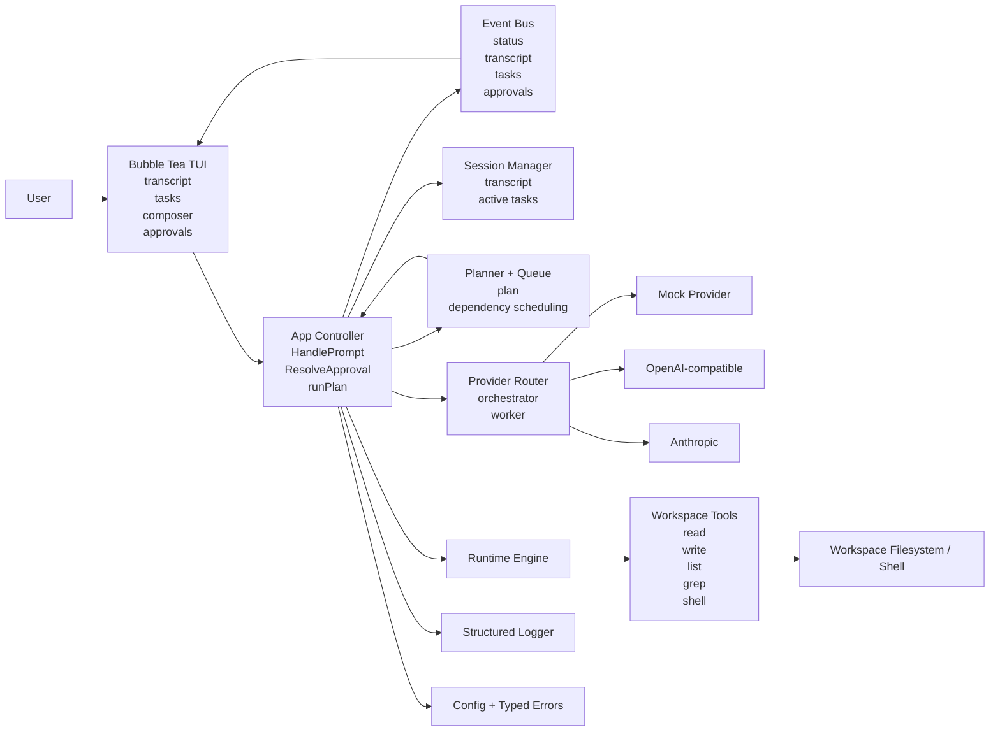

# YC Prototype Delivery Plan

## Goal

Build the prototype directly in `crawler-ai` as a Go terminal coding assistant with:

- a strong interactive TUI
- concrete code execution and file editing
- visible task orchestration
- independent orchestrator and worker model selection
- a submission-quality UX by April 3

The v1 product must stand on its own without Claude Code as the front-end shell.

## Codebase Reuse Strategy

### Open Multi-Agent

Reference files:

- `open-multi-agent/src/orchestrator/orchestrator.ts`
- `open-multi-agent/src/orchestrator/scheduler.ts`
- `open-multi-agent/src/task/queue.ts`
- `open-multi-agent/src/team/team.ts`
- `open-multi-agent/src/types.ts`

Use for:

- minimal orchestration shape
- task graph and dependency model
- planner -> worker flow
- agent/team/task contracts

Decision:

- use as the implementation baseline for orchestration
- keep the same mental model, not the same language/runtime

### Crush

Reference files:

- `crush/AGENTS.md`
- `crush/internal/ui/AGENTS.md`

Use for:

- highly interactive Go TUI shape
- runtime and service boundaries
- terminal UX patterns
- top-level UI model design

Decision:

- use the same class of Go libraries and architectural patterns
- do not attempt to transplant Crush internals wholesale before the deadline

### Ruflo

Reference files:

- `ruflo/README.md`
- `ruflo/v3/README.md`
- `ruflo/AGENTS.md`

Use for:

- future backend adapter target
- future multi-agent delegation path
- coordination ideas that can be added later

Decision:

- do not make Ruflo part of the April 3 critical path
- keep it behind a future backend interface

### Claw Code

Reference file:

- `claw-code/PARITY.md`

Use for:

- warning list of common harness gaps
- reminder to avoid overpromising plugins, hooks, and huge feature breadth in v1

Decision:

- stay narrow, concrete, and demoable

## Stack

### Language

Go

Reason:

- fastest path to a polished interactive terminal app
- aligns with the Crush ecosystem
- easiest to ship as a demoable binary

### TUI Libraries

- Bubble Tea
- Lip Gloss
- Bubbles
- Glamour

Reason:

- highest confidence path to a premium terminal UX
- supports panes, input, task views, status bars, dialogs, and streaming output well

### Storage

SQLite with a pure-Go driver

Reason:

- sessions, transcripts, tasks, and usage data need persistence
- pure-Go keeps Windows setup simpler

### Model Layer

Our own provider abstraction

Initial providers:

- Anthropic
- one OpenAI-compatible endpoint

Reason:

- orchestrator model choice must belong to us
- worker model choice must also belong to us

## Architecture

### 1. App Shell

Owns:

- startup
- config loading
- workspace detection
- session restore
- dependency wiring

### 2. TUI

Owns:

- transcript pane
- input composer
- task pane
- activity panel
- approval modals
- model selection controls
- status and usage display

### 3. Runtime

Owns:

- tool execution
- permission checks
- transcript events
- cancellation
- retries and error handling

Initial tools:

- file read
- file write
- grep
- shell
- list files

### 4. Orchestrator

Owns:

- request classification
- task creation
- task status tracking
- planner -> worker flow

Initial modes:

- direct single-agent
- planner -> worker
- planner -> worker -> reviewer if time permits

### 5. Backend Interface

Owns:

- a common contract for task execution backends

Implementations:

- local runtime backend
- Ruflo backend later

### 6. Provider Interface

Owns:

- model calls
- streaming
- tool-call normalization
- token accounting

### Current Prototype Architecture Flow

### Current Implementation Notes

- the app controller is the hub that wires UI, runtime, provider routing, sessions, approvals, and orchestration together
- the TUI only consumes typed messages and must stay decoupled from provider/runtime internals
- sessions currently persist in memory; SQLite remains the intended next persistence layer
- reviewer is part of the task model and planning shape, but the current provider router only distinguishes orchestrator and worker roles

## Production TUI Bar

Contributors should treat the TUI as a product surface, not a debug shell.

The target bar is closer to Crush, OpenCode, or Claude Code than to a developer demo.

Must feel production-level in these areas:

- visual hierarchy must be intentional, with strong pane emphasis, spacing rhythm, and readable density
- interactions must feel alive, with visible progress, streaming feel, status transitions, and clear focus handling
- error handling must be graceful, with inline error states, recovery paths, retries where safe, and non-destructive failures
- tool execution must be visible, with running, success, failure, and approval states presented as first-class UI events
- keyboard UX must be strong, with reliable submit, cancel, approval flow, history, and slash-command ergonomics
- task orchestration must read like a live board, not a plain text list

TUI quality rules:

- do not add UI features that bypass typed events or mutate runtime/provider state directly
- do not surface raw stack traces or raw transport failures directly into the main transcript without formatting
- do not ship placeholder styling if the feature is user-facing in the demo path
- prefer dedicated UI states over plain status strings when a workflow has distinct phases
- every new failure path should have a visible user-facing response and a structured log entry

## Phases

### Phase 0 — Scope Lock and Contracts

- [x] Freeze the April 3 product cut
- [x] Freeze domain contracts for events, tasks, sessions, tool events, approvals, and model config
- [x] Freeze repo/package layout inside `crawler-ai`

Depends on:

- none

Parallelization:

- no parallel work until contracts are stable

Output:

- one stable set of shared contracts for the whole team

### Phase 1 — Foundation

- [x] Create Go module and app bootstrap
- [x] Create config loading and app lifecycle
- [x] Create event bus and domain types
- [x] Create session and transcript state model
- [x] Create global production/development logger and typed error handling

Depends on:

- Phase 0

Parallelization:

- after this phase, TUI, runtime, provider, and orchestration can split safely

Output:

- stable base for all parallel workstreams

### Phase 2A — TUI Shell

- [x] Build top-level Bubble Tea model
- [x] Build transcript pane
- [x] Build task pane
- [x] Build input composer
- [x] Build status bar and modal approval overlay

Depends on:

- Phase 1

Parallelization:

- can run in parallel with Phase 2B and Phase 2C

Output:

- interactive TUI that renders mocked transcript/task data

### Phase 2B — Runtime and Tools

- [x] Implement runtime loop
- [x] Implement file read tool
- [x] Implement file write tool
- [x] Implement grep tool
- [x] Implement list files tool
- [x] Implement shell tool
- [x] Add approvals for write and shell

Depends on:

- Phase 1

Parallelization:

- can run in parallel with Phase 2A and Phase 2C

Output:

- real execution engine with structured events

### Phase 2C — Provider Layer

- [x] Implement provider interface
- [x] Implement Anthropic adapter
- [x] Implement OpenAI-compatible adapter
- [x] Normalize streaming events
- [x] Track token usage
- [x] Separate orchestrator and worker model settings

Depends on:

- Phase 1

Parallelization:

- can run in parallel with Phase 2A and Phase 2B

Output:

- reusable model backend with independent routing control

### Phase 3 — Stitch Point 1: Single-Agent Product

- [x] Integrate TUI + runtime + provider layer
- [x] Support one real end-to-end prompt flow
- [ ] Show streaming output in transcript
- [x] Show approvals in the UI
- [ ] Show tool execution state in the UI

Depends on:

- Phase 2A
- Phase 2B
- Phase 2C

Parallelization:

- orchestration work can begin once the stitch contracts are proven stable

Output:

- a strong single-agent coding assistant that already works end to end

### Phase 4A — Task Graph and Scheduler

- [x] Implement task graph
- [x] Implement dependency-aware queue
- [x] Implement task status transitions
- [x] Implement dependency-first scheduler

Depends on:

- Phase 1

Parallelization:

- can run in parallel with late Phase 3 stabilization if contracts are fixed

Output:

- orchestration core independent from UI and runtime specifics

### Phase 4B — Planner -> Worker Flow

- [x] Add planner role
- [x] Generate structured task list from user request
- [x] Feed tasks into scheduler
- [x] Execute worker tasks through runtime
- [ ] Add optional reviewer pass only if earlier phases are stable

Depends on:

- Phase 3
- Phase 4A

Parallelization:

- limited task-UI work can happen in parallel

Output:

- visible orchestration flow that is better than a plain single-agent assistant

### Phase 5 — Stitch Point 2: Orchestrated Product

- [x] Connect orchestration to live TUI updates
- [x] Show task creation and task status changes in real time
- [x] Show active assignee/role in UI
- [x] Show task completion and results in transcript and task pane

Depends on:

- Phase 4A
- Phase 4B

Parallelization:

- demo polish can begin after the first successful integration

Output:

- first version that clearly shows an Open Multi-Agent-style architecture

### Phase 6 — YC Demo Polish

- [ ] Improve streaming feel and responsiveness
- [ ] Improve layout and readability
- [ ] Improve task affordances
- [ ] Improve approval UX
- [ ] Add dedicated live activity rail for tool and model events
- [ ] Add rich error banners, retry affordances, and graceful failure states
- [ ] Add command history, slash-command hints, and stronger keyboard ergonomics
- [ ] Add session resume
- [ ] Add basic usage/cost display
- [ ] Rehearse and stabilize demo flows

Depends on:

- Phase 3 for early polish
- Phase 5 for full polish

Parallelization:

- can run continuously after each stitch point

Output:

- demo build for submission

### Phase 7 — Post-Submission Ruflo Adapter

- [ ] Define backend adapter interface
- [ ] Add Ruflo adapter behind orchestration boundary
- [ ] Map internal tasks to Ruflo jobs
- [ ] Normalize results back into our UI/runtime model

Depends on:

- Phase 5

Parallelization:

- not part of the April 3 critical path

Output:

- future scale-up path without changing the user-facing product core

## Parallel Workstreams

### Workstream A — App Shell and Contracts

- [x] Domain types
- [x] Event bus
- [x] Config
- [x] App bootstrap

Owner profile:

- core architect

Blocks:

- all other workstreams if delayed

Stitch point:

- Phase 1

### Workstream B — TUI

- [x] Layout
- [x] Keyboard flow
- [x] Transcript rendering
- [x] Task pane
- [x] Status line
- [x] Approval modal
- [ ] Activity/event rail
- [ ] Rich transcript blocks and streaming presentation
- [ ] Production styling system and responsive pane behavior
- [ ] Graceful error surfaces and retry affordances

Owner profile:

- strongest terminal/frontend engineer

Depends on:

- Phase 1 contracts

Stitch point:

- Phase 3

### Workstream C — Runtime and Tools

- [x] Tool execution
- [x] File tools
- [x] Shell tool
- [x] Approvals
- [x] Execution events
- [x] Errors and cancellation

Owner profile:

- runtime/systems engineer

Depends on:

- Phase 1 contracts

Stitch point:

- Phase 3

### Workstream D — Provider Layer

- [x] Provider abstraction
- [x] Anthropic path
- [x] OpenAI-compatible path
- [x] Streaming normalization
- [x] Usage tracking

Owner profile:

- backend/API engineer

Depends on:

- Phase 1 contracts

Stitch point:

- Phase 3

### Workstream E — Orchestration Core

- [x] Task queue
- [x] Scheduler
- [x] Planner output schema
- [x] Planner -> worker flow

Owner profile:

- algorithm/backend engineer

Depends on:

- Phase 1 contracts
- Phase 3 for end-to-end validation

Stitch point:

- Phase 5

### Workstream F — Demo Polish and QA

- [ ] UX tightening
- [ ] Demo script validation
- [ ] Error-state testing
- [ ] Session continuity
- [ ] Presentation quality
- [ ] TUI production-bar review against Crush/OpenCode/Claude Code expectations
- [ ] visual polish pass on spacing, readability, and interaction clarity
- [ ] terminal resilience pass for resize, long output, and approval edge cases

Owner profile:

- product-minded engineer

Depends on:

- Phase 3 first
- Phase 5 for final polish

Stitch point:

- Phase 6

## Safe Parallelization Rules

1. The TUI must consume typed events and state snapshots, not call runtime or provider code directly.
2. The runtime must emit structured events and tool results, not terminal-formatted strings.
3. The provider layer must return normalized responses and streaming events, not UI-facing payloads.
4. The orchestration layer must operate on task and agent contracts only and must not know about Bubble Tea components.
5. Merge boundaries should be package boundaries: UI, runtime, provider, orchestration, store/app.
6. If a feature requires touching all layers at once, defer it until after the nearest stitch point.

## Stitch Milestones

### Stitch 1 — Contracts Stable

- [x] Merge app shell
- [x] Merge types
- [x] Merge event bus
- [x] Merge config
- [x] Freeze core interfaces

Success condition:

- contract churn stops and parallel work can continue safely

### Stitch 2 — Single-Agent Product

- [ ] Merge TUI
- [ ] Merge runtime
- [ ] Merge provider layer
- [ ] Run one real end-to-end prompt flow

Success condition:

- one real prompt can execute tools and stream output end to end

### Stitch 3 — Orchestrated Product

- [x] Merge task graph
- [x] Merge planner workflow
- [x] Merge live task UI
- [x] Run one full planner -> worker flow

Success condition:

- planner visibly creates tasks and worker execution updates the UI in real time

### Stitch 4 — Demo Build

- [ ] Merge polish work
- [ ] Merge session resume
- [ ] Merge usage display
- [ ] Lock demo scenarios

Success condition:

- reliable YC submission demo

## Recommended Repo Shape

- `cmd/app`
- `internal/app`
- `internal/config`
- `internal/events`
- `internal/session`
- `internal/ui`
- `internal/runtime`
- `internal/tools`
- `internal/provider`
- `internal/orchestrator`
- `internal/store`
- `internal/domain`

## April 3 Scope Rules

Must have:

- [ ] real interactive TUI with production-level feel
- [ ] real single-agent execution
- [ ] real tools
- [ ] selectable orchestrator model
- [ ] selectable worker model
- [ ] visible tasking
- [ ] approvals for dangerous actions
- [ ] graceful error handling across UI, tools, and provider failures

Nice to have:

- [ ] reviewer pass
- [ ] limited parallel worker execution
- [ ] better cost display
- [ ] more polished session resume

Not in scope for April 3:

- [ ] full Ruflo integration
- [ ] plugin platform
- [ ] vector memory
- [ ] broad MCP-first architecture
- [ ] distributed consensus systems

## Final Team Guidance

The highest risk is product feel, not orchestration breadth.

If time compresses:

1. keep TUI quality
2. keep runtime reliability
3. keep visible task orchestration
4. cut reviewer
5. cut parallel execution
6. cut Ruflo entirely from the submission path

Nice to have:
- Ruflo-backed swarm mode
- multi-agent visualization
- shared memory

Do not attempt:
- full plugin system
- full hook system
- large markdown/bootstrap system
- complex MCP-first architecture as the core

## Concrete Repo Shape

- cmd/app
- internal/app
- internal/ui
- internal/runtime
- internal/orchestrator
- internal/provider
- internal/backend/local
- internal/backend/ruflo
- internal/tools
- internal/store
- internal/task
- internal/session

## Final Product Positioning

This product is:
- our own terminal AI orchestrator
- interactive first
- model-provider agnostic
- concrete and useful as a single-agent assistant

This product is not:
- a thin wrapper around Claude Code
- a direct fork of Ruflo
- a full multi-agent research platform in v1